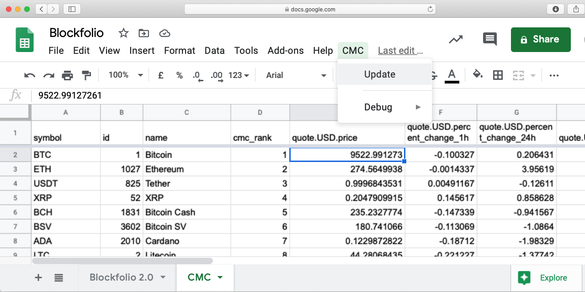

# coinmarketcap-google-sheet

Get data directly from coinmarketcap.com to your google sheet!

## How-to:

1. Register an account on http://pro.coinmarketcap.com/ and get API key (it has free plan for personal use).

2. Open your google sheet and choose Tools/Script Editor in main menu.

3. Copy code from file [./Code.gs](Code.gs) in this repository and paste it to opened editor.

4. In line 40 change API key to yours.

5. Save (choose File/Save in main menu).

6. Return to your opened google sheet in other tab and reload it.

7. You will see new item 'CMC' in main menu. Choose 'Update' from it. Script will run. Give access script to change your sheet. After some seconds new sheet CMC with data will appears.

8. Use [VLOOKUP](https://support.google.com/docs/answer/3093318?hl=en) function to get data.
